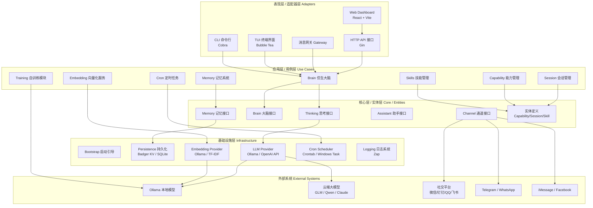
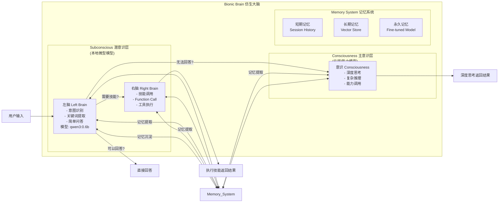
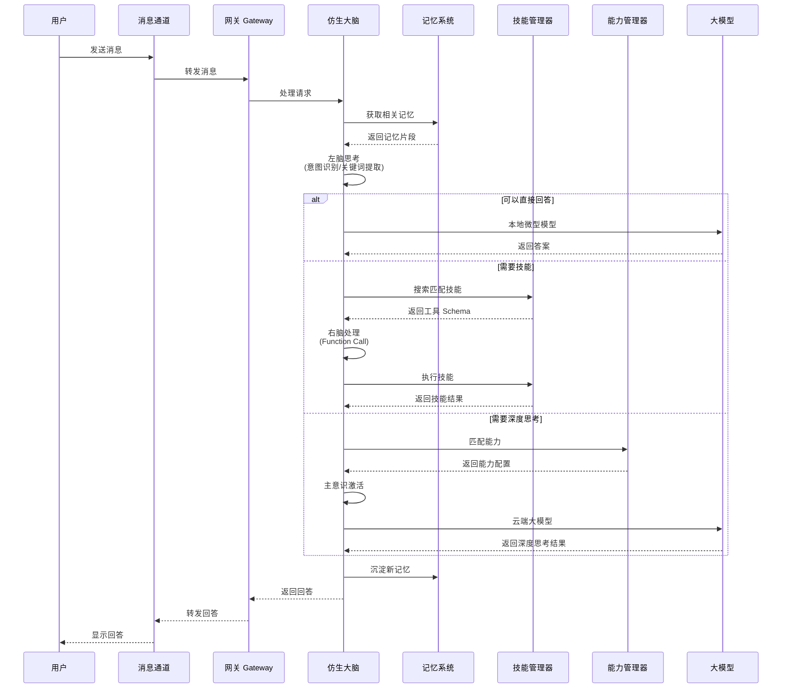
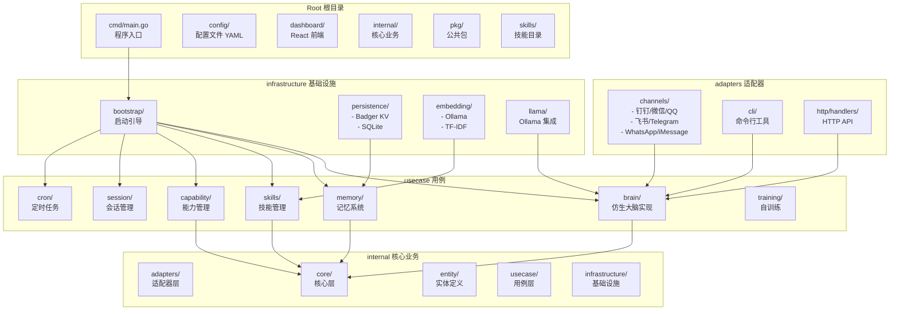

# MindX 系统架构

> 一个具备思考能力且可自主进化的 AI 智能助手

---

## 一、整体架构（整洁架构 Clean Architecture）

---

## 二、仿生大脑架构

---

## 三、消息处理流程

---

## 四、目录结构与模块关系

---

## 📋 架构关键特性说明

| 层级/组件 | 颜色 | 说明 |
|-----------|------|------|
| 表现层 | 🔵 | Web、CLI、TUI、多渠道消息接入 |
| 应用层 | 🟢 | 仿生大脑、记忆、技能、能力、会话管理 |
| 核心层 | 🟡 | 接口定义、实体、业务规则 |
| 基础设施层 | 🔴 | 持久化、模型集成、日志、调度 |
| 左脑 | 🟣 | 本地微型模型，快速处理简单任务 |
| 右脑 | 🔴 | 技能调用、Function Call 执行 |
| 主意识 | 🔵 | 深度思考、复杂推理、云端模型 |
| 记忆系统 | 🟢 | 短期/长期/永久记忆三层结构 |

---

## 🛠 技术栈

| 类别 | 技术 |
|-----|-----|
| 后端 | Go 1.25+、Gin、Cobra、Bubble Tea |
| 前端 | React、Vite、Tailwind CSS |
| 数据库 | Badger KV、SQLite |
| 模型 | Ollama、OpenAI API、GLM、Qwen |
| 日志 | Zap、Lumberjack |
| 配置 | Viper、YAML |

---

## 📦 项目核心组件说明

### 1. 整洁架构四层设计

- **表现层/适配器层**：负责外部交互，包括Web界面、命令行、终端界面、多渠道消息接入、HTTP API
- **应用层/用例层**：包含核心业务逻辑，包括仿生大脑、记忆系统、技能管理、能力管理、会话管理、定时任务、向量化服务、自训练模块
- **核心层/实体层**：定义核心接口和业务实体，包括思考接口、大脑接口、记忆接口、助手接口、通道接口
- **基础设施层**：提供技术支持，包括启动引导、持久化、模型集成、日志系统、调度器

### 2. 仿生大脑三层结构

- **左脑**：使用本地微型模型（如 qwen3:0.6b），负责意图识别、关键词提取、简单问答
- **右脑**：负责技能调用、Function Call 执行
- **主意识**：深度思考、复杂推理，使用云端大模型
- **记忆系统**：短期记忆、长期记忆、永久记忆三层结构

### 3. 支持的社交渠道

- 钉钉、微信、QQ、飞书、WhatsApp、Telegram、iMessage、Facebook 等
