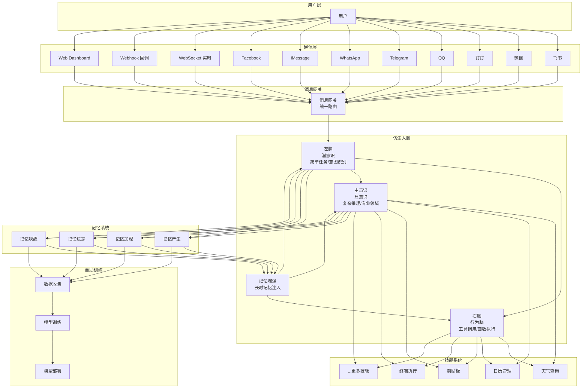

# 心智 | MindX


> 一个有脑子又能自我演进成长的数字化分身

---

## 项目简介

心智 | MindX 是一个轻量级、会思考可自主进化的AI个人助理。率先采用创新的**仿生大脑架构**设计，充分地发挥了本地大模型在无算力环境下仍然能完成绝大多数日常任务，让云端大模型在必要时再执行，这极大地降低了Token的消耗。它不仅是一个简单的问答系统，而是一个具备"思考、记忆、执行、进化"能力的完整智能体，能够通过配置不同技能适配各类任务，支持本地模型部署，保护数据隐私。

## 起源

这个项目是受到OpenClaw的启发，在OpenClaw刚发布的当天我就疯狂地玩了两天，开始觉得它很聪明貌似好多的活会自动在后台完成，而且还可以与飞书通信。但我慢慢开始发现它变得越来越“蠢”似乎思维速度在持续地退化，最终发现是QWenChat的羊毛薅光了，我还很记得当时它的统计是Token用量为680%。这两天下来的感觉是兴奋属于高开低走，它的实际智能还比不上AI开发工具，可能我是能用上Opus吧，据说只要付得起钱一天烧个100~200刀用Opus可以玩得很爽。可见OpenClaw的理念虽好，但是个烧钱怪，而且根本不是给中国人设计的整个技能生态度极度不友好，我们不过就是上去凑热闹凑合着用，中国人用得多了自然也会被卡脖子。

但我实在是太想来一把钢铁侠般的体验，如果身边真的能有一个贾维斯那将会是多么Cool的事？

从技术层 大模型玩错了！大家都在疯狂地比谁家的模型大，谁的参数多谁更能烧算力谁就是地表最强，而用户呢钱=Token，被模型厂疯狂地消耗。我不相信没有人看不到这点，但同时我相信看到这点的人都很乐意让这种态势继续下去，因为烧用户的钱实在太好烧了没有比这个更来钱的。

打个比方，你会去请一个院士回来天天帮你算加减乘除，而只是在小量的情况下才让他给你算些高深的数学？从OpenClaw不就是可见一斑了吗？GPT+Opus可是它的官方推荐配置，然后呢用它们来写备忘？执行命令行？给你买咖啡？是钱太多没地方用想送给特不靠谱吗？无论国内外就算是新跟进厂发布要做的Agent没有一个是真的为我们用户在想的，一切对话皆要钱，一切行为皆收费！
So，我必须打破这种阴谋！个人助理会知道我们的一切，包括大量的行为习惯与安全隐私，因此它不应该是一个可以被任何人、任何商家裹挟的软件！

综上所述，我给这个项目定的目标是：

1. 必须将Token的消耗降到最低，至少占所有现有同款软件的10%以内；
2. 必须保护用户数据隐私；
3. 必须完全支持中国软件生态；
4. 必须开源，让更多的中国人能参与到这个项目，打破国外垄断，打破厂商依赖；

我认为当下的AI软件基本没有"脑子"，是否聪明完全依赖于大模型的能力，所以同类软件基本没有粘性，随便都可以被平替，AI编程工具就是一个最好的例子。我是从仿生学的角度来思考如何设计MindX的架构的。一个人日常大多数行为其实并不会动脑，因为人的大脑实在是太耗能了，动脑会大量消耗我们的能量，这与美国人狂烧Token导致资源耗尽的道理是不是很相似？你试试让你全力动脑想问题你能支持多久？所以，人主要是靠“潜意识”层来支配日常行为，因为记忆力不单单存在于我们的大脑，还有很大一部分是在潜意识与身体中，也就是“身体记忆”

也就是说，要降低Token的消耗的话只要给AI助手装载进一个具有潜意识层与主意识层的代码机构，不就完成了吗？

深入地看"身体记忆"，其实就是我们的日常行为习惯，或者后天因长期重复相同行为而形成的习惯，也就是"技能"。同样地，Agent的技能(Skill)本身就不是什么高深技术，只是一些简单的命令行或API接口，根本不需要动脑就能使用。只要触发条件达成就会“反射”式地执行，无论是人还是命令这个道理都是相通的。

古话说得好“技多不压身”，一个人如果会的技能越多是不是给人的印象就越深刻，因为他“能干”啊！试想一想，如果男人们都会煮饭，会买菜，会搞卫生，会健身，会逗比最后还会赚钱的话估计也没有单身这个词了。

那主意识是什么？主意识是指我们需要集中脑力时的控制中心，甚至需要进入深层的"心流"状态以最大限度地发挥大脑的思考能力，简单地说就是**主动控制大脑思考的意识**。思考是一件非常消耗脑力的事情，但是长期的思考、记忆、整理再思考就会让我们获得另一种东西："能力"。能力是需要后天长期的思考、记忆与理解后才可能获得的，例如：写作能力、绘画能力、运算能力等等。这才是大模型该待的地方！

AI不动用能力的时候就不应该消耗Token！做些毫无技术含量的事情就应该用技能，技能越多就越能干，就算笨点我是可以接受的，我要AI助理又不要是AI陪聊，大不了就是个憨憨AI，只要能用就行。

最后，人如果没有记忆力会变成什么？金鱼吗？现代的AI有点像得了持续性健忘症的人，大模型能记住的也就是一个会话窗口中那几轮少得可怜的对话，同样的事情经常需要重复跟它说，似乎大家除了做上下文压缩外，也没有想过其他办法。为此，我决定为MindX配置一个长时记忆系统去治愈AI们的这种持续性健忘症。

MindX最大的核心价值不仅仅在于它高效的大脑，更在于它的记忆系统。我也采用了仿生学的设计理念，仿效人脑的记忆机制，将记忆分为：永久性记忆、长期性记忆和短期性记忆。采用复合式权重对记忆进行排序。永久性记忆相当于模型本身的能力不会因为时间的流逝而变弱 ，长期性记忆就是那些被经常提及又或被故意强调记住的信息，除此之外随着时间的推移其它的记忆都会转变为短期记忆被排在记忆系统的深处。

MindX的大脑在每次对话时都会主动调取与谈话内容相关的记忆内容作为参考，这样就完全解决了由于的会话上下文窗口的限制导致健忘症。并且MindX会自动整理自己的记忆，清洗掉重复的记忆内容，在技术上采用性能极高的嵌入式KeyValue数据库Badger作为记忆的载体，对记忆内容进行向量化索引以支持语义化的搜索与超高速的存取。

随着时间的推移，记忆体中会存入我们与AI交流的大量对话内容。MindX内置Lora模型训练机制，以当前主脑采用的本地模型作为底模，以记忆中的信息作为训练素材，进行持续化增量式的微调训练，将长期记忆与短期记忆融入模型之中。每天晚上你在睡觉的时候它就在自我训练，自我进化。只要你天天使用它，它将会越来越懂你，最终成为你的数字分身。


## 为什么选择心智 | MindX？

### 与 OpenClaw 的对比

| 特性     | MindX                                                                                           | OpenClaw                         |
| -------- | ----------------------------------------------------------------------------------------------- | -------------------------------- |
| 架构设计 | 仿生大脑架构（左脑+右脑+主意识）                                                                | 控制平面架构                     |
| 模型支持 | 本地模型优先（Ollama），支持云端API                                                             | 主要依赖云端API（Claude、GPT-4） |
| 数据隐私 | 完全本地运行，数据不上传云端                                                                    | 部分功能依赖云端                 |
| 记忆系统 | 自动总结整理，越用越快                                                                          | 基础存储，越用越慢               |
| 技能系统 | CLI方式，完全兼容OpenClaw技能                                                                   | 插件系统，需特定格式             |
| 自助训练 | 基于用户对话训练专属模型，持续进化                                                              | 不支持自助训练                   |
| 部署方式 | 本地部署，无服务器依赖                                                                          | 支持本地和云端部署               |
| 通信方式 | 飞书、微信、钉钉、QQ、WhatsApp、Telegram、iMessage、Facebook、WebSocket、Webhook 全通信渠道支持 | WhatsApp、Telegram、Discord等    |
| 资源消耗 | 轻量级，适合个人电脑                                                                            | 需要更多资源                     |
| 定制性   | 高度可定制，支持自定义模型和技能                                                                | 中等定制性                       |

###  MindX 的核心优势

#### 1. 仿生大脑架构，更智能的决策

- **分层思考**：左脑处理简单任务，主意识处理复杂任务，资源利用率更高
- **动态切换**：根据任务复杂度自动切换思考模式，无需人工干预
- **意图识别**：内置意图提取和关键词匹配，精准理解用户需求

#### 2. 本地模型优先，保护隐私

- **完全本地运行**：支持 Ollama 等本地模型，数据不上传云端
- **零网络依赖**：离线环境下仍可正常工作
- **成本可控**：无需支付昂贵的 API 费用

#### 3. 长时记忆系统，越用越快

- **自动总结**：自动从对话中提取关键信息，生成记忆摘要
- **智能整理**：基于权重自动整理记忆，定期清理低权重内容
- **持续优化**：记忆系统随着使用不断优化，检索速度越来越快
- **越用越快**：与 OpenClaw 不同，心智 | MindX 的记忆系统不会因为数据增多而变慢

#### 4. 灵活技能系统，完全兼容 OpenClaw

- **完全兼容**：直接复制 OpenClaw 的技能即可使用，无需修改
- **CLI 方式**：支持任意编程语言，降低开发门槛
- **即插即用**：技能目录结构简单，安装卸载便捷
- **智能搜索**：基于向量检索和关键词匹配的智能技能推荐

#### 5. 轻量级设计，易于部署

- **无大型数据库**：使用 SQLite 存储数据，资源占用小
- **单一二进制**：编译后只有一个可执行文件，部署简单
- **跨平台**：支持 macOS、Linux 等多种平台

#### 6. 自助训练系统，用得越多越懂你

- **专属模型**：基于你的对话和记忆训练，完全适配你的个人风格
- **低门槛训练**：约 500M 轻量级底模，CPU 即可训练，无需 GPU
- **夜间自动训练**：在你睡觉时自动训练，不影响白天使用
- **持续进化**：从第 1 周开始理解你的基本偏好，到第 6 个月成为你的"数字分身"

---

## 系统架构



---

## 核心组件

### 一、通信系统

MindX 完全支持国内全通信生态和国际主流平台，覆盖飞书、微信、钉钉、QQ、WhatsApp、Telegram、iMessage、Facebook 等多种即时通讯平台。

#### 1.1 消息网关

**职能**：统一消息路由，支持多渠道接入、智能转发和渠道切换。

消息网关是通信系统的核心协调者，能够统一管理所有通信渠道的消息路由、转发和渠道切换，实现多渠道统一接入和无缝协作。

**核心架构**：

- **Gateway（网关）**：消息路由和分发中心，协调各渠道工作
- **ChannelManager（渠道管理器）**：统一管理渠道生命周期
- **ChannelRegistry（渠道注册中心）**：工厂模式实现配置驱动的渠道创建
- **ChannelContextManager（渠道上下文管理器）**：管理会话级别的渠道状态

**核心功能**：

- **消息路由**：智能路由消息到正确的处理流程
- **消息转发**：支持在不同渠道之间转发消息，包含来源信息
- **渠道切换**：支持会话级别的渠道动态切换
- **语义匹配**：集成 Embedding 服务，通过语义相似度自动匹配目标渠道
- **信息同步**：所有渠道的消息自动同步到 RealTimeChannel，确保 Web UI 和 Terminal UI 能看到完整对话
- **优雅关闭**：支持等待活跃消息处理完成后再关闭，避免消息丢失

**特点**：

- **统一抽象接口**：所有渠道实现相同接口，使用一致
- **配置驱动初始化**：通过配置文件灵活启用/禁用渠道
- **会话上下文管理**：每个会话维护独立的渠道状态
- **完整的可观测性**：详细的日志记录、对话日志、健康检查
- **高并发安全**：所有核心组件线程安全，支持高并发

#### 1.2 全通信生态支持

**职能**：支持国内外主流即时通讯平台，无缝接入企业办公和个人社交

**支持的渠道**：

- **飞书**：企业级即时通讯，支持群聊和私聊，完美适配企业办公场景
- **钉钉**：企业级即时通讯，支持机器人集成，适合企业内部协作
- **微信**：腾讯即时通讯，支持公众号和小程序，触达最广泛用户
- **QQ**：腾讯即时通讯，支持机器人，覆盖年轻用户群体
- **Telegram**：国际主流即时通讯，支持机器人，全球覆盖
- **WhatsApp**：全球最大即时通讯平台，支持机器人，触达国际用户
- **iMessage**：苹果原生即时通讯，支持 iOS 用户
- **Facebook**：Facebook Messenger，国际社交平台
- **RealTimeChannel**：基于 WebSocket 的实时通信，支持 Web UI 和 Terminal UI
- **WebhookChannel**：Webhook 回调渠道，支持自定义集成

**优势对比**：

- **OpenClaw**：主要支持 WhatsApp、Telegram、Discord 等国外平台
- **MindX**：完全支持国内外全通信生态，更适合中国用户和全球用户

#### 1.3 Web Dashboard

**职能**：现代化的 Web 界面，可视化交互

Web Dashboard 是心智 | MindX 的可视化界面，它提供了现代化的 Web 界面，支持实时对话、历史记录、设置面板等功能。

**特点**：

- **实时对话**：流式输出 AI 响应，代码高亮
- **历史记录**：查看和管理历史对话
- **设置面板**：配置模型参数和技能管理
- **监控面板**：实时监控系统状态和性能

### 二、会话系统

职能：

- 负责对话去重，清洗，避免大模型因在多轮对话中的重复性及无效性信息过多导致分散注意力；
- 负责会话中Token用量统计；
- 负责会话数据存取；

### 三、仿生大脑系统

MindX 的核心是仿生大脑架构，模拟人脑的思考机制，实现更智能的决策。 仿生大脑从概念上由潜意识与主意识构成；

**潜意识层**负责日常事务处理，虽然它可能显得不太聪明，但只要给它配置足够多的技能，它就会变得很能干。

**主意识层**负责能力调用，也就是高级云端大模型的调用，它的核心构成就是智能体+大模型，你可以根据你需要的职能或专业领域去为你的助手配置相应的能力。

潜意识层与人脑一样，是双脑结构。左脑负责逻辑判断，右脑负责行为动作；这是考虑到本地小型量化的大模型的决策与理解能力是远远不及满血版本的。那就需要将工作进行明确分工，我们的大脑不也是这样的吗？当潜意识层发现用户提出的问题与决策意图超出了自己能回答的范畴就会启动主意识由云端大模型来处理。用技术性的话来说这是一种：端-端-云的模型通信结构。让本地化大模型完成简单而直接任务，让云端大模型完成复杂而耗时的思考。各司其责，而不是什么都由云端进行处理，直接压死算力。

大脑中的每次思考都会与记忆系统相连，以确保你所提及过的一切有用信息它都能“记”得住，而且速度贼快！

潜意识层与主意识层的大脑模型都可以根据你的机器来选择，最低可以支持8G毫无算力的机器，如果你的机器有一定的算力那就可以选用更聪明一点的模型，这样你的对话能力也能更强。

大脑模型预设选用Qwen3家族系列的模型， 默认使用QWen3:0.6b，它是一个仅仅只有500多M的gguf的量化模型，还能支持深度思考。如果你的机器配有3060以上的卡可以考虑 QWen3:4b的模型，它是这个家族中在个人电脑上跑起来最好用的一款，对话长度也是最长的可以达到250K，可以让每个会话窗口的对话轮数达到2400多轮。

大脑是思考的中枢也是支配的中枢，所以除了可以三脑协作之外还会自动分析判断可时调用“技能”可时启用“能力”，在保证最低Token消耗之余确保对话的流畅性。


#### 3.1 左脑（潜意识）

**职能**：处理简单任务、快速响应、意图识别

左脑是大脑的第一道防线，负责快速处理用户的日常请求。它使用轻量级模型，能够在毫秒级别给出响应。

**特点**：
- **快速响应**：使用轻量级模型，响应速度快
- **意图识别**：自动提取用户意图和关键词
- **能力判断**：智能判断自己能否回答问题，避免无效思考
- **历史管理**：支持多轮历史对话，保持上下文连贯性

**适用场景**：
- 简单问答（如"你好"、"今天天气"）
- 意图识别（如"播放音乐"、"设置提醒"）
- 快速对话（如闲聊、简单查询）

#### 3.2 右脑（行为脑）

**职能**：负责工具调用、函数执行

右脑是大脑的执行中枢，负责将抽象的意图转化为具体的工具调用。它使用专用的函数调用模型，能够精准地生成工具参数。

**特点**：
- **函数调用**：基于 Function Calling 标准，生成工具调用参数
- **参数验证**：自动验证工具参数的完整性和正确性
- **错误处理**：完善的错误处理和重试机制
- **流式执行**：支持流式输出，提升用户体验

**适用场景**：
- 工具调用（如"播放周杰伦的歌"）
- 参数生成（如"查询北京天气"）
- 技能执行（如"设置明天下午3点的提醒"）

#### 3.3 主意识（显意识）

**职能**：处理复杂推理、深度思考、专业领域任务

主意识是大脑的深度思考中心，负责处理需要复杂推理的任务。它使用大模型，能够进行深度分析和专业咨询。

**特点**：
- **动态创建**：根据任务复杂度动态创建，节省资源
- **深度思考**：使用大模型，处理复杂问题
- **专业能力**：支持自定义能力定义，适配专业领域
- **长时记忆**：支持多轮历史对话，深度上下文理解

**适用场景**：
- 复杂推理（如"解释量子纠缠的原理"）
- 专业咨询（如"分析这个代码的性能问题"）
- 深度分析（如"总结这篇论文的核心观点"）

#### 3.4 大脑核心组件

仿生大脑由多个核心组件协作完成思考流程：

**核心组件**：

- **ContextPreparer（上下文准备器）**：整合长时记忆和历史对话，为思考提供上下文
- **TokenBudgetManager（Token预算管理器）**：动态管理 Token 预算，根据实际消耗优化上下文长度
- **ThinkingStream（思考流）**：实时推送思考过程事件，支持进度展示
- **ToolCaller（工具调用器）**：执行工具发现、调用和结果回传
- **FallbackHandler（降级处理器）**：在主意识失败时提供兜底方案
- **ResponseBuilder（响应构建器）**：构建统一格式的响应

**处理流程**：
1. 接收用户请求
2. 搜索长时记忆、获取历史对话
3. 左脑进行意图分析和关键词提取
4. 根据左脑结果决定处理路径：
   - 无需处理：直接返回
   - 可回答：左脑直接回答
   - 需要工具：右脑处理
   - 需要复杂思考：主意识处理
5. 构建统一响应返回

**Token 预算管理**：
- 基于实际运行时的 Token 消耗动态调整
- 使用平滑更新避免剧烈波动
- 公式：`最大轮数 = (模型容量 - 预留输出) / 平均每轮消耗`

**思考流事件**：
- `ThinkingEventStart`：开始思考
- `ThinkingEventProgress`：思考进度
- `ThinkingEventChunk`：流式输出片段
- `ThinkingEventToolCall`：工具调用
- `ThinkingEventToolResult`：工具调用结果
- `ThinkingEventComplete`：思考完成
- `ThinkingEventError`：思考错误

#### 3.5 记忆增强

**职能**：将长时记忆融入思考过程，提升回答质量

记忆增强是连接大脑和记忆系统的桥梁，能够智能地检索相关记忆，并将其注入到思考过程中。

**特点**：
- **记忆检索**：基于关键词和向量相似度检索相关记忆
- **上下文注入**：将检索到的记忆注入到思考提示中
- **个性化回答**：基于用户历史和偏好提供个性化回答
- **持续学习**：每次对话都会产生新的记忆点

---

### 四、长时记忆系统

记忆系统仿照人脑的记忆机制，实现学习、遗忘、唤醒的完整生命周期。**自动总结整理，越用越快。**

就像人的记忆一样，我们并不会记住生活中每一个场景中发生的每一个细节，但我们总是能记住某个时刻发生过些什么，大脑是对过去大量的信息进行筛选总结后将最需要记住的片段留下来，当我们回想过去时就会从这个记忆点上回忆。记忆系统就是根据这个原理从对话中过滤、筛选、去重、总结、提炼形成记忆点，保留下来。

然后根据时间，聚焦，强调三种维度作为复合权重作为记忆索引排序的依据。我们在与仿生大脑对话时就会从这些记忆点中搜索定位最匹配内容作为参考。

#### 4.1 记忆产生

**职能**：从对话中自动提取和存储记忆点

记忆产生是记忆系统的起点，能够智能地从对话中提取有价值的信息，并将其转化为可检索的记忆点。

**特点**：
- **自动提取**：无需人工干预，自动从对话中提取重要信息
- **智能摘要**：生成简洁的记忆摘要，便于快速检索
- **关键词提取**：自动提取关键词，支持多维度检索
- **分类存储**：按主题和类型分类存储，便于管理

#### 4.2 记忆加深

**职能**：通过时间、重复、强调等因素计算记忆权重

记忆加深是记忆系统的强化机制，通过多维度因素计算记忆的权重，确保重要的记忆更容易被检索到。

**特点**：
- **时间权重**：越近的记忆权重越高
- **重复权重**：重复出现的记忆权重增加
- **强调权重**：用户强调的信息权重更高
- **综合计算**：多维度权重综合计算，更准确

#### 4.3 记忆遗忘

**职能**：随着时间流逝，记忆权重逐渐衰减

记忆遗忘是记忆系统的自然机制，能够模拟人脑的自然遗忘过程，保持记忆系统的高效。

**特点**：
- **自然遗忘**：模拟人脑的自然遗忘过程
- **权重衰减**：低权重记忆逐渐被遗忘
- **定期清理**：自动清理过期记忆，保持系统高效
- **可配置性**：遗忘速度可配置

#### 4.4 记忆唤醒

**职能**：通过搜索重新激活记忆，增加其权重

记忆唤醒是记忆系统的检索机制，能够通过多维度检索重新激活记忆，并增加其权重。

**特点**：
- **多维度检索**：支持关键词、向量相似度等多维度检索
- **智能排序**：按权重排序，优先返回相关记忆
- **权重更新**：检索到的记忆权重增加，模拟记忆强化
- **上下文感知**：根据当前对话上下文调整检索结果

#### 4.5 性能优化

**职能**：持续优化记忆系统，越用越快

性能优化是记忆系统的持续改进机制，能够随着使用不断地自我整理，优化检索性能。

**特点**：
- **自动整理**：定期整理记忆索引，优化检索性能
- **缓存优化**：热点记忆自动缓存，提升访问速度
- **增量索引**：新增记忆增量索引，不影响现有检索
- **性能监控**：实时监控记忆系统性能，自动优化

---

### 五、技能系统

MindX 的技能系统，支持任意编程语言，具有轻量级、可扩展、易维护的特点。**完全兼容 OpenClaw 的所有技能，直接复制过来即可使用。**

#### 5.1 技能管理

**职能**：统一管理所有技能的加载、搜索、执行

技能管理是技能系统的核心，能够自动发现、加载、管理所有技能，并提供统一的执行接口。

**特点**：
- **完全兼容 OpenClaw**：直接复制 OpenClaw 的技能即可使用，无需修改
- **自动发现**：自动扫描技能目录，发现新技能
- **依赖管理**：自动管理技能依赖，确保运行环境完整
- **环境变量**：支持技能环境变量配置，保护敏感信息
- **启用/禁用**：支持技能的启用和禁用，灵活控制

#### 5.2 技能搜索

**职能**：基于向量检索和关键词匹配的智能技能推荐

技能搜索是技能系统的智能推荐机制，能够根据用户的意图智能地推荐相关技能。

**特点**：
- **向量检索**：基于技能描述的向量相似度检索
- **关键词匹配**：支持关键词匹配，提高检索准确度
- **混合排序**：结合向量相似度和关键词匹配的混合排序
- **预计算**：支持向量预计算，提升检索速度

#### 5.3 技能执行

**职能**：安全、高效地执行技能

技能执行是技能系统的执行引擎，能够安全、高效地执行技能，并返回执行结果。

**特点**：
- **环境隔离**：每个技能在独立环境中执行，避免冲突
- **超时控制**：支持超时控制，防止技能卡死
- **错误处理**：完善的错误处理和日志记录
- **流式输出**：支持流式输出，提升用户体验

#### 5.4 技能架构与组件

技能系统采用 Facade 设计模式，通过 `SkillMgr` 作为统一入口，协调各子组件完成复杂的技能管理任务。

**核心组件**：

- **SkillLoader（技能加载器）**：加载和解析技能定义文件
- **SkillExecutor（技能执行器）**：在隔离环境中执行技能命令
- **SkillSearcher（技能搜索器）**：向量相似度搜索 + 关键词匹配
- **SkillIndexer（技能索引器）**：预计算技能向量，支持持久化
- **SkillConverter（技能转换器）**：更新技能元数据格式
- **Installer（依赖安装器）**：支持多种包管理器安装依赖
- **EnvManager（环境管理器）**：管理技能执行的环境变量

**内置技能**：

MindX 内置了多个实用技能，包括：
- **Cron 定时任务**：设置和管理定时任务
- **Deep Search**：深度搜索功能
- **Web Search**：网页搜索
- **Open URL**：打开网页
- **Write File**：写入文件
- 以及其他 30+ 个内置技能

#### 5.5 技能开发

**职能**：简单易用的技能开发框架

技能开发是技能系统的开发框架，它提供了简单易用的开发接口，降低技能开发门槛。

**特点**：
- **任意语言**：支持任意编程语言，降低开发门槛
- **简单结构**：只需 SKILL.md 文件和 CLI 脚本
- **快速开发**：无需复杂配置，几分钟即可开发一个技能
- **丰富示例**：提供丰富的技能示例，参考学习

---

### 六、能力系统

**职能**：支持自定义专业领域能力，让 AI 助理具备专业知识

能力系统是 MindX 的高级功能，允许用户定义和配置特定领域的专业能力，每个能力都可以配置独立的模型、提示词和工具集。

**核心功能**：

- **能力配置**：定义能力名称、图标、描述、模型、系统提示词
- **工具集**：每个能力可以配置专属的工具列表
- **模态支持**：支持多种模态（文本、图像等）
- **语义匹配**：基于向量相似度智能匹配最适合的能力
- **动态加载**：按需加载能力，节省资源
- **默认能力**：可设置默认能力处理通用任务

**能力配置示例**：

每个能力包含以下属性：
- `name`：能力唯一标识
- `title`：显示标题
- `icon`：图标
- `description`：详细描述
- `model`：使用的模型
- `system_prompt`：系统提示词
- `tools`：工具列表
- `modality`：支持的模态
- `enabled`：是否启用

**工作方式**：
1. 左脑分析用户问题
2. 通过向量相似度匹配最适合的能力
3. 动态创建主意识（Consciousness）
4. 使用能力配置的模型和提示词处理问题
5. 调用能力专属的工具集

---

### 七、定时任务系统

**职能**：支持技能定时执行，实现自动化工作流

定时任务系统允许用户设置技能的定时执行，实现自动化工作流。支持跨平台调度（Linux/macOS 使用 Crontab，Windows 使用任务计划）。

**核心功能**：

- **任务管理**：添加、删除、更新、查询定时任务
- **任务控制**：暂停、恢复、立即运行任务
- **状态追踪**：记录任务执行状态和错误信息
- **跨平台支持**：Linux/macOS 使用 Crontab，Windows 使用任务计划
- **技能集成**：直接调用技能执行
- **持久化存储**：任务配置持久化保存

**任务属性**：
- Cron 表达式
- 技能名称
- 执行参数
- 任务描述
- 执行状态（成功/失败）
- 最后执行时间
- 错误信息

---

### 八、自助训练系统

**用得越多，助理越懂你**

MindX 的自助训练系统让 AI 助理能够通过持续学习，逐渐成为完全理解你的专属智能体。这不是简单的数据存储，而是真正的模型进化。

#### 8.1 核心理念

**为什么需要自助训练？**

传统的 AI 助理使用的是通用模型，它们"博学但不专精"——知道很多，但不理解你的个人偏好、工作习惯、表达方式。MindX 的自助训练系统通过以下方式解决这个问题：

- **训练素材**：你的历史对话 + 记忆点 = 专属训练数据
- **底模选择**：约 500M 的轻量级模型，"刚好够用"
- **训练方式**：LoRA 增量训练，只训练差异部分
- **最终成果**：完全适配你的专有模型

**训练流程**

```
你的日常使用 → 对话记录 + 记忆点 → 自动收集 → 夜间训练 → 模型进化
```

#### 8.2 训练架构与组件

**核心组件**：

- **MemoryAdapter（记忆适配器）**：将 Memory 模块适配为训练数据源
- **Collector（数据收集器）**：从记忆系统提取训练数据
- **Filter（语料过滤器）**：清洗和筛选训练数据
- **Generator（数据生成器）**：生成训练数据集和 Modelfile
- **Validator（模型验证器）**：评估模型效果
- **ConfigUpdater（配置更新器）**：管理模型配置的更新与回滚

**两种训练模式**：

1. **Message 模式（默认）**：
   - 通过 Modelfile 的 MESSAGE 指令注入对话历史
   - 速度快（秒级完成）
   - 无需额外依赖
   - 效果为上下文记忆，非永久改变

2. **LoRA 模式**：
   - 通过 Python 脚本进行真正的 LoRA 微调
   - 效果持久，改变模型行为
   - 需要 Python 环境
   - CPU 训练速度较慢

#### 8.3 数据收集

**职能**：自动从你的对话和记忆中提取训练素材

数据收集是自助训练系统的第一步，能够智能地从你的对话和记忆中提取训练素材。

**特点**：
- **对话记录**：自动收集所有对话历史，包括问题和回答
- **记忆点**：从长时记忆系统中提取高权重的记忆点
- **智能筛选**：过滤低质量对话，保留有价值的训练样本
- **隐私保护**：所有数据本地存储，不上传云端

**数据清洗流程**：
```
原始语料 → 低价值清洗 → 敏感信息过滤 → 内容去重 → 向量去重 → 高质量语料
```

#### 8.4 模型训练

**职能**：基于轻量级底模进行 LoRA 增量训练

模型训练是自助训练系统的核心，基于轻量级底模进行 LoRA 增量训练，生成你的专属模型。

**特点**：
- **轻量级底模**：约 500M 参数，对硬件要求极低
- **LoRA 训练**：只训练差异部分，训练速度快
- **无 GPU 也能训练**：CPU 即可完成训练，适合个人电脑
- **夜间自动训练**：在你睡觉时自动开始训练，不影响白天使用

**资源消耗**：
| 模式       | 内存  | 磁盘  | 时间      |
| ---------- | ----- | ----- | --------- |
| message    | 低    | <10MB | 秒级      |
| lora (CPU) | 4-8GB | 2-5GB | 分钟~小时 |

#### 8.5 模型部署

**职能**：训练完成后自动部署，无缝切换

模型部署是自助训练系统的最后一步，将训练完成的模型自动部署到 Ollama，实现无缝切换。

**特点**：
- **自动部署**：训练完成后自动部署到 Ollama
- **效果验证**：通过向量相似度评估模型效果
- **平滑切换**：只有新模型分数高于基础模型才会更新配置
- **版本管理**：保留所有历史版本，随时回退
- **自动备份**：每次更新前自动备份配置文件

#### 8.6 持续进化

**职能**：随着使用时间增长，模型越来越懂你

持续进化是自助训练系统的最终目标，让模型随着使用时间增长，越来越懂你。

**进化时间线**：

- **第 1 天**：开始使用，收集初始对话数据
- **第 1 周**：完成第一轮训练，模型开始理解你的基本偏好
- **第 1 个月**：模型熟悉你的工作习惯和表达方式
- **第 3 个月**：模型能够预判你的需求，主动提供建议
- **第 6 个月**：模型成为你的"数字分身"，几乎完全理解你

**进化维度**：

1. **语言风格**：理解你的表达习惯、用词偏好、语气特点
2. **知识结构**：学习你的专业知识、工作领域、兴趣方向
3. **决策逻辑**：模仿你的思考方式、决策偏好、价值取向
4. **行为模式**：适应你的工作节奏、生活习惯、时间安排

---

### 九、HTTP API 接口

**职能**：提供完整的 RESTful API，支持前端和第三方集成

MindX 提供了完整的 RESTful API 接口，涵盖所有核心功能，便于前端和第三方系统集成。

**核心 API 分组**：

#### 9.1 健康检查与服务控制

- `GET /api/health` - 健康检查
- `POST /api/service/start` - 启动服务
- `POST /api/service/stop` - 停止服务
- `GET /api/service/ollama-check` - 检查 Ollama 状态
- `POST /api/service/ollama-install` - 安装 Ollama
- `POST /api/service/model-test` - 测试模型

#### 9.2 会话管理

- `GET /api/conversations` - 列出所有会话
- `POST /api/conversations` - 创建新会话
- `GET /api/conversations/current` - 获取当前会话
- `GET /api/conversations/:id` - 获取指定会话
- `POST /api/conversations/:id/switch` - 切换会话
- `DELETE /api/conversations/:id` - 删除会话

#### 9.3 渠道管理

- `GET /api/channels` - 列出所有渠道
- `PUT /api/channels/:id` - 更新渠道配置
- `POST /api/channels/:id/config` - 更新渠道配置
- `POST /api/channels/:id/toggle` - 启用/禁用渠道
- `POST /api/channels/:id/start` - 启动渠道
- `POST /api/channels/:id/stop` - 停止渠道

#### 9.4 技能管理

- `GET /api/skills` - 列出所有技能
- `GET /api/skills/reindex/status` - 获取重建索引状态
- `POST /api/skills/reindex` - 触发重建索引
- `GET /api/skills/:name` - 获取技能详情
- `GET /api/skills/:name/dependencies` - 获取依赖
- `GET /api/skills/:name/env` - 获取环境变量
- `GET /api/skills/:name/stats` - 获取统计信息
- `POST /api/skills/:name/convert` - 转换技能格式
- `POST /api/skills/:name/install` - 安装依赖
- `POST /api/skills/:name/install/runtime` - 安装运行时
- `POST /api/skills/:name/env` - 设置环境变量
- `POST /api/skills/:name/validate` - 验证技能
- `POST /api/skills/:name/enable` - 启用技能
- `POST /api/skills/:name/disable` - 禁用技能
- `POST /api/skills/batch/convert` - 批量转换
- `POST /api/skills/batch/install` - 批量安装

#### 9.5 能力管理

- `GET /api/capabilities` - 列出所有能力
- `GET /api/capabilities/reindex/status` - 获取重建索引状态
- `POST /api/capabilities/reindex` - 触发重建索引
- `POST /api/capabilities` - 添加能力
- `PUT /api/capabilities` - 更新能力
- `DELETE /api/capabilities` - 删除能力

#### 9.6 Cron 任务管理

- 完整的定时任务 CRUD 接口
- 支持暂停、恢复、立即运行任务
- 查看任务执行历史

#### 9.7 设置与配置

- `GET /api/settings` - 获取设置
- `POST /api/settings` - 保存设置
- `GET /api/config/general` - 获取常规配置
- `POST /api/config/general` - 保存常规配置
- `GET /api/config/server` - 获取服务器配置
- `POST /api/config/server` - 保存服务器配置
- `GET /api/config/models` - 获取模型配置
- `POST /api/config/models` - 保存模型配置
- `GET /api/config/capabilities` - 获取能力配置
- `POST /api/config/capabilities` - 保存能力配置
- `GET /api/config/advanced` - 获取高级配置
- `POST /api/config/advanced` - 保存高级配置

#### 9.8 监控与统计

- `GET /api/monitor` - 获取监控日志
- `DELETE /api/monitor` - 清除日志
- `GET /api/token-usage/by-model` - 按模型的 Token 使用统计
- `GET /api/token-usage/summary` - Token 使用汇总

---

### 十、配置管理

**职能**：灵活的配置系统，支持多种配置文件

MindX 采用模块化配置系统，将不同功能的配置分离到独立文件中，便于管理和维护。

#### 10.1 配置文件结构

```
config/
├── server.yml          # 服务器和模型配置
├── channels.json       # 通信渠道配置
├── advanced.yml        # 高级配置
└── capabilities.json   # 能力配置
```

#### 10.2 服务器配置 (server.yml)

核心配置，定义大脑模型、API 端点等。

```yaml
server:
  ollama_url: "http://localhost:11434/v1"
  brain:
    leftbrain:
      name: "qwen3:0.6b"
      base_url: "http://localhost:11434/v1"
      temperature: 0.7
      max_tokens: 40960
    rightbrain:
      name: "qwen3:0.6b"
      base_url: "http://localhost:11434/v1"
      temperature: 0.7
      max_tokens: 40960
    token_budget:
      reserved_output_tokens: 8192
      min_history_rounds: 5
      avg_tokens_per_round: 200
```

#### 10.3 渠道配置 (channels.json)

定义各通信渠道的参数。

```json
{
  "feishu": {
    "app_id": "cli_a1b2c3d4e5f6g7h8",
    "app_secret": "xyz123abc456def789",
    "encrypt_key": "encryptionkey123",
    "verification_token": "verifytoken456"
  },
  "wechat": {
    "app_id": "wx1234567890abcdef",
    "app_secret": "abcdef1234567890abcdef1234567890"
  },
  "dingtalk": {
    "app_key": "dingabcdef123456",
    "app_secret": "secret1234567890"
  }
}
```

#### 10.4 高级配置 (advanced.yml)

定义向量维度、训练参数等高级设置。

---

## Quick Start

### 环境要求

- **操作系统**：macOS、Linux
- **Go 版本**：1.25 或更高
- **Ollama**：已安装并运行（用于本地模型）
- **Python**：3.8 或更高（用于技能训练）

### 安装步骤

#### 1. 克隆项目

```bash
git clone https://github.com/yourusername/mindx.git
cd mindx
```

#### 2. 安装依赖

```bash
# 安装 Go 依赖
go mod download

# 安装 Python 依赖（可选，用于技能训练）
pip install -r requirements.txt
```

#### 3. 配置 Ollama

```bash
# 拉取模型
ollama pull qwen3:0.6b
ollama pull qwen3:1.7b
ollama pull functiongemma:270m

# 验证安装
ollama list
```

#### 4. 配置系统

编辑 `config/server.yml`，配置模型参数：

```yaml
server:
  ollama_url: "http://localhost:11434/v1"
  brain:
    leftbrain:
      name: "qwen3:0.6b"
      base_url: "http://localhost:11434/v1"
      temperature: 0.7
      max_tokens: 40960
    rightbrain:
      name: "qwen3:0.6b"
      base_url: "http://localhost:11434/v1"
      temperature: 0.7
      max_tokens: 40960
    token_budget:
      reserved_output_tokens: 8192
      min_history_rounds: 5
      avg_tokens_per_round: 200
```

#### 5. 启动服务

```bash
# 启动主服务
./start.sh

# 或使用 Makefile
make start
```

#### 6. 访问 Dashboard

打开浏览器访问 `http://localhost:911`，即可开始使用。

### 配置通信渠道

#### 飞书

1. 在飞书开放平台创建应用
2. 获取 App ID 和 App Secret
3. 配置 `config/channels.json`：

```json
{
  "feishu": {
    "app_id": "your_app_id",
    "app_secret": "your_app_secret",
    "encrypt_key": "your_encrypt_key",
    "verification_token": "your_verification_token"
  }
}
```

#### 微信

1. 在微信公众平台注册公众号
2. 获取 App ID 和 App Secret
3. 配置服务器地址和 Token

#### 钉钉

1. 在钉钉开放平台创建应用
2. 获取 App Key 和 App Secret
3. 配置机器人回调地址

### 安装技能

```bash
# 复制技能到技能目录
cp -r /path/to/skill skills/

# 重启服务
./start.sh
```


## 技术栈

### 核心技术

- **后端**：纯 Go 1.25+ 开发，原生代码，天生高性能
  - Go 语言的高并发特性，轻松处理多用户并发
  - 原生编译，无需虚拟机，直接运行于操作系统
  - 静态类型，编译时检查，保证代码质量
  - 内存管理高效，GC 优化，运行稳定

- **前端**：React 18 + TypeScript + Vite
- **数据库**：SQLite
- **向量存储**：BadgerDB
- **模型服务**：Ollama
- **通信协议**：WebSocket
- **UI 组件库**：TDesign React
- **样式框架**：Tailwind CSS

### Go 语言优势

MindX 采用纯 Go 语言开发，充分利用 Go 语言的特性：

- **高性能**：原生编译，直接运行，性能接近 C/C++
- **低资源占用**：内存占用小，CPU 利用率高，适合个人电脑
- **快速启动**：编译后的二进制文件启动速度快，秒级响应
- **跨平台**：一次编译，多平台运行（macOS、Linux、Windows）
- **易部署**：单一二进制文件，无需依赖，部署简单
- **高并发**：Goroutine 轻量级协程，轻松处理多用户并发
- **稳定性**：强类型系统，编译时检查，减少运行时错误

---

## 加入我们

我建立这个项目并开源的目的是希望能为打造属于我们中国人的AI助手出一分力，我希望每个人都能享受到技术带来的便利而不是让这些优秀的理念成为商家掠夺我们的工具！

个人的力量是单薄的，但我相信众志成城可以借助更多与我有共同想法与志愿的朋友们一齐推动这个项目发展起来，我希望你能成为这个项目的核心贡献者之一。

## 许可证

MIT License

---

**心智 | MindX - 让你的个人助理更智能**
